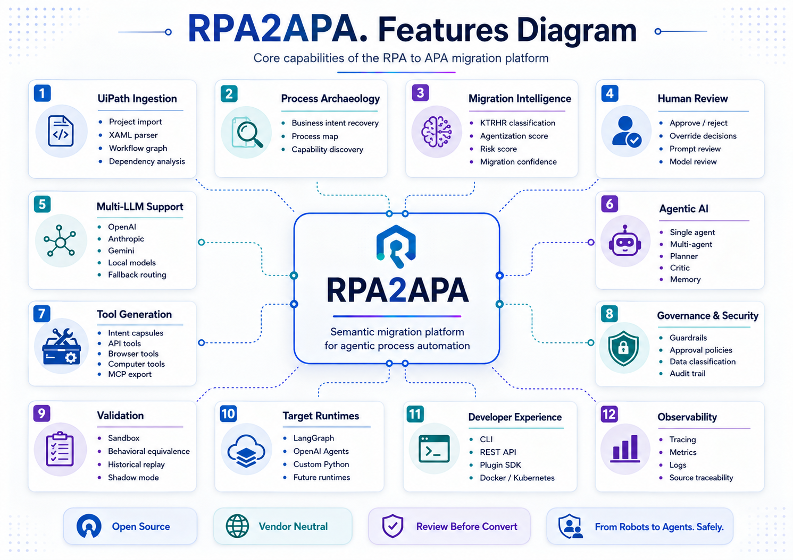
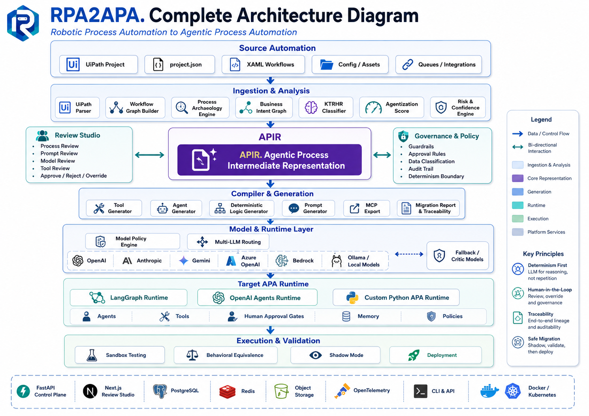
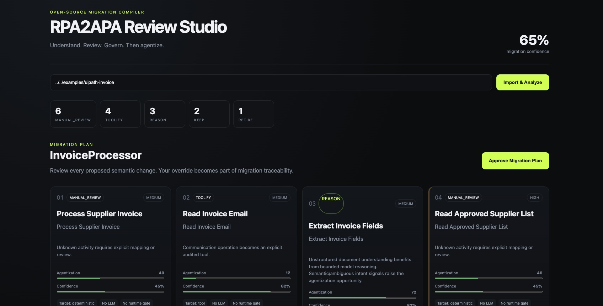
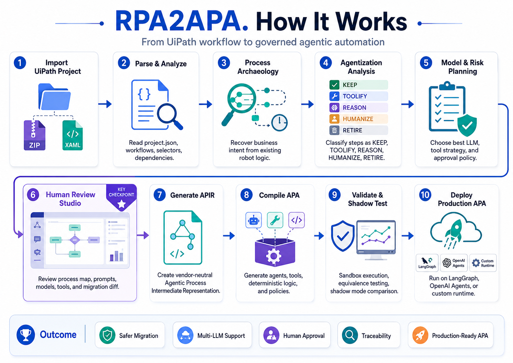

# RPA2APA

**RPA2APA (Robotic Process Automation to Agentic Process Automation)** is an open-source migration compiler and governance platform that transforms UiPath RPA projects into reviewable, testable Agentic Process Automation (APA) systems.

> From Robots to Agents. Safely.



## What makes RPA2APA different

RPA2APA does not perform a blind `XAML -> Python` translation. It:

1. Parses UiPath projects structurally.
2. Reconstructs business intent with Process Archaeology.
3. Builds a vendor-neutral APIR (Agentic Process Intermediate Representation).
4. Classifies each step as **KEEP, TOOLIFY, REASON, HUMANIZE, RETIRE**.
5. Computes agentization, risk, and migration-confidence scores.
6. Lets humans review and override every material migration decision.
7. Routes agent tasks across multiple cloud or local LLMs using policy.
8. Generates a bounded LangGraph-style APA project with deterministic tools and guardrails.
9. Runs sandbox and behavioral-equivalence evaluations before production approval.
10. Preserves full source-to-target traceability.

## Repository layout

```text
apps/
  api/                 FastAPI control plane and migration engine
  web/                 Next.js Review Studio
  xaml-worker/         Optional .NET/CoreWF structural parser service
packages/
  rpa2apa_cli/         Python CLI
  apir/                APIR JSON Schema and examples
examples/
  uipath-invoice/      Small UiPath-style fixture project
  generated-apa/       Example generated agentic process
infra/
  docker/              Container files
  k8s/                 Kubernetes starter manifests
docs/                   Architecture, security, extension SDK notes
```

## Architecture



## Quick start

### 1. Run backend locally

```bash
cd apps/api
python3 -m venv .venv
.venv/bin/python -m pip install -e '.[dev]'
cd ../..
make api-run
```

### 2. Run CLI

```bash
pip install -e packages/rpa2apa_cli
rpa2apa analyze examples/uipath-invoice
rpa2apa plan examples/uipath-invoice --output /tmp/rpa2apa-plan
rpa2apa convert examples/uipath-invoice --output /tmp/generated-apa --target python
```

### 3. Run Review Studio

```bash
cd apps/web
npm install
npm run dev
```

Open `http://localhost:3000`.



### 4. Docker Compose

```bash
docker compose up --build
```

## LLM providers

The API includes provider adapters for:

- OpenAI-compatible endpoints
- Anthropic-compatible HTTP API
- Gemini-compatible HTTP API
- Ollama
- local deterministic/mock model for tests

Model use is governed by `ModelPolicyEngine`. Provider calls are disabled unless explicitly configured. Sensitive data can be routed to local models.

## Safe-by-default conversion



A migration has explicit states:

```text
IMPORTED -> ANALYZED -> NEEDS_REVIEW -> PLAN_APPROVED -> GENERATED
-> VALIDATED -> SHADOW_TESTING -> PRODUCTION_APPROVED -> DEPLOYED
```

`convert` refuses agentic compilation when `require_review=true` and the plan has not been approved.

## APIR

APIR is a vendor-neutral process format. See:

- `packages/apir/schema/apir.schema.json`
- `packages/apir/examples/invoice.apir.yaml`

## Extending RPA2APA

Plugins can provide:

- source parsers
- activity mappers
- model providers
- target compilers
- tools
- evaluators

See `docs/PLUGIN_SDK.md`.

## Tests

```bash
cd apps/api
pytest
```

The repository contains unit tests for parsing, classification, policy routing, approval enforcement, APIR generation, and compilation.

## Security note

Generated agents are not automatically safe because they use an LLM. RPA2APA enforces deterministic tool boundaries, explicit approvals, policy checks, cost/step budgets, and source traceability. Production users should additionally integrate their organization IAM, secret manager, network policies, and audit pipeline.

## License

Apache-2.0. See `LICENSE`.
